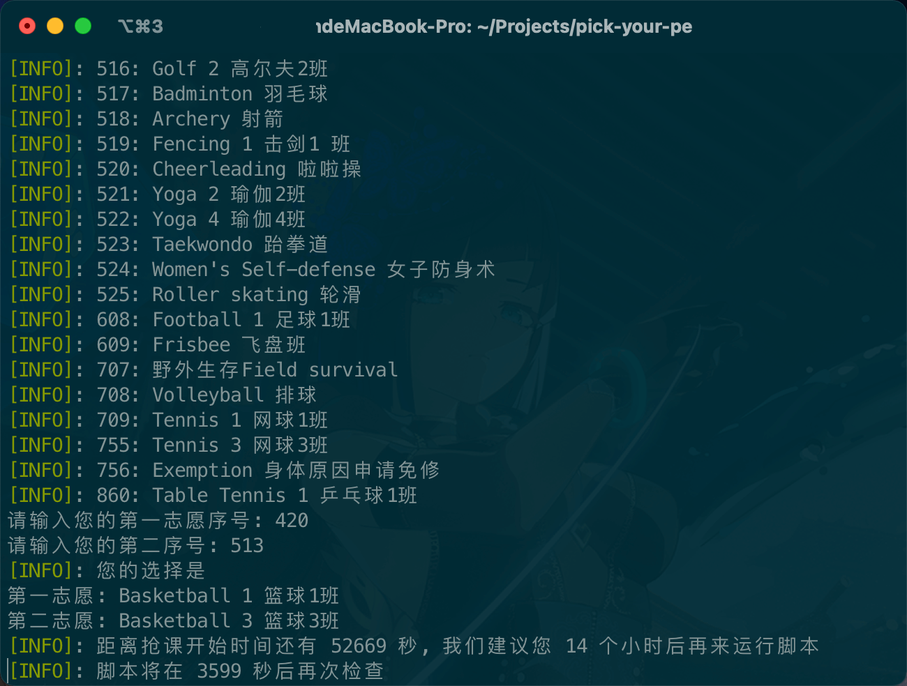

# Pick your favorite PE lession!

免责声明:

1. 本脚本不对任何网络拥堵负责，实际上您也并不需要负责。
2. 本脚本不涉及任何破坏性行为，本质上为模拟您浏览选课页面的完整过程。

⚠️ 本脚本的原理在课程开始选择前 30 秒开始尝试循环提交您的选择，并不能保证您一定能抢到课程。
在到达开始选择课程的规定时间后的 10 次提交或 10 秒内，如您的第一志愿并没有成功，脚本会开始提交第二志愿。

当前 PeSelection 页面，只有部分同学更新了选课课程，未更新的同学，请在选择当日重试。

当前脚本仍在完善中，请务必保持脚本更新。

- [ ] 获得选择成功的返回结果(需要第一批选课的同学配合抓包)
- [ ] 持久化课程选择
- [x] 加入第二志愿


|||
|--|--|
| |  |


## 使用教程

环境: Python 3.8 以上

### 二进制运行

### 源码运行

```shell
git clone https://github.com/AprilNEA/pick-your-pe.git
cd pick-your-pe

# install dependency
pip3 install -r requirements.txt

# run scripts
python3 pick-your-pe.py
```
