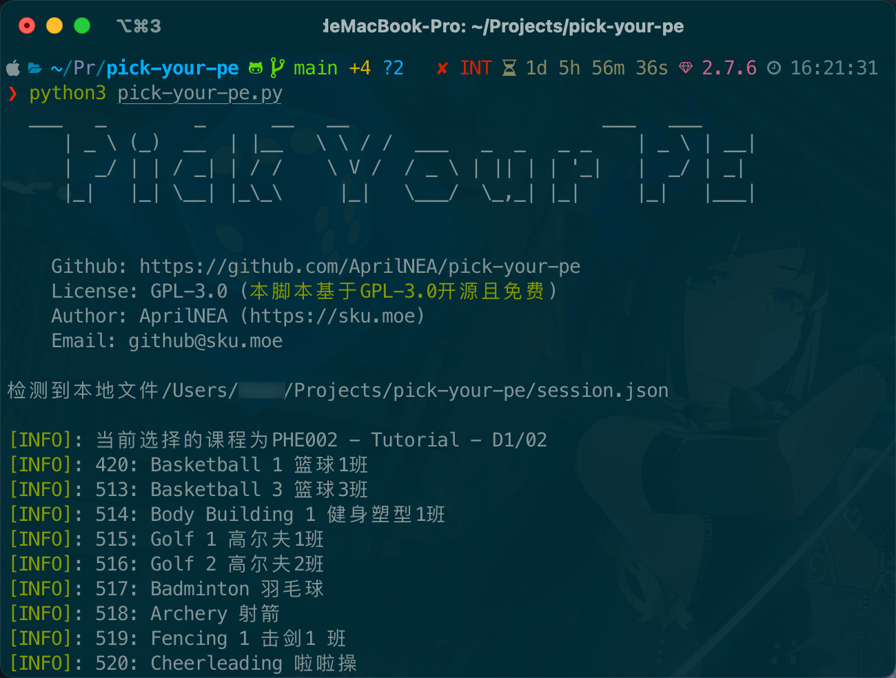

# Pick your favorite PE lession!

当前 PeSelection 页面，只有部分同学更新了选课课程，未更新的同学，请在选择当日重试。

当前脚本仍在完善中，请务必保持脚本更新。
- [ ] 持久化课程选择
- [ ] 获得选择成功的返回结果(需要第一批选课的同学配合抓包)
- [ ] 加入第二备选




## 使用教程
环境: Python 3.8 以上

### 二进制运行


### 源码运行
```shell
git clone https://github.com/AprilNEA/pick-your-pe.git
cd pick-your-pe

# install dependency
pip3 install -r requirements.txt

# run scripts
python3 pick-your-pe.py
```

## 免责声明

